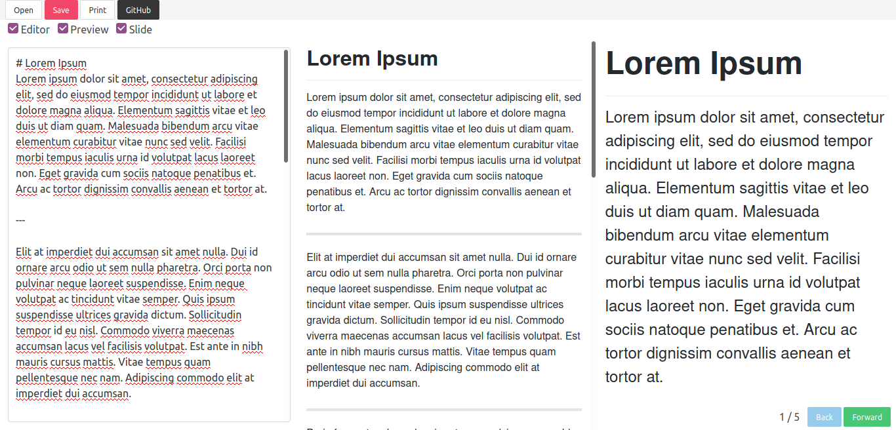

# Portable-Markdown-Editor
 A markdown editor in one HTML file.

## Screenshot

## How to use
1. Download `markdown-editor.html`, and put it where you want.
2. Open the file in a web browser.
3. Now you can use Markdown **Editor** and **Slide**!!

* You can also use this app on https://sorutoproject.github.io/Portable-Markdown-Editor/markdown-editor.html

## Features
* GFM Support
* Markdown Preview
* Markdown Slides
    * Use `---` or `***` to page break in slide mode.
* Emoji Support

## Notice
* the file size of `markdown-editor.html` is large, so I recommend **Visual Studio** to open the file. Other editors may be crash when open the file. 

## Dependencies
> All dependencies are included in `markdown-editor.html`
* [Bulma](https://github.com/jgthms/bulma)
* [github-markdown-css](https://github.com/sindresorhus/github-markdown-css)
* [highlight.js](https://github.com/highlightjs/highlight.js)
* [Vue v.2.x](https://github.com/vuejs/vue)
* [marked.js](https://github.com/markedjs/marked)
* [DOMPurify](https://github.com/cure53/DOMPurify)
* [js-emoji](https://github.com/iamcal/js-emoji)
* [KaTex](https://github.com/KaTeX/KaTeX)